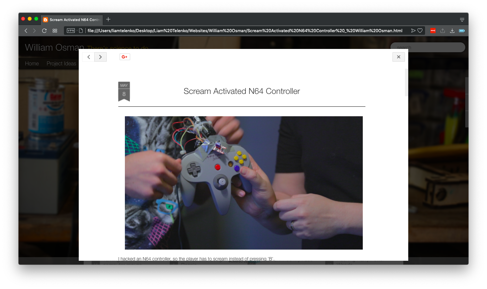

# William-Osman-Site-Fix
A custom add-on CSS stylesheet for William Osman's Blog.

## About
This style sheet updates William Osman's existing blog with a new, cleaner UI.

## Implementation
The CSS stylesheet can be taged onto the end of the webpage's HTML document. The attributes override the CSS stylesheets previously loaded to apply the new design. 

Add one of the following lines of code at the end of the ```<head></head>``` secion of the page or before the final ```</html>``` tag at the end of the page.

#### Self Hosted Stylesheet
```
<link rel="stylesheet" type="text/css" href="path/to/stylesheet/update.min.css">
```

#### Repo Hosted Stylesheet
```
<link rel="stylesheet" type="text/css" href="https://raw.githubusercontent.com/mailtelenko/William-Osman-Site-Fix/production/stylesheet/update.min.css">
```




## Author
- Liam Telenko
